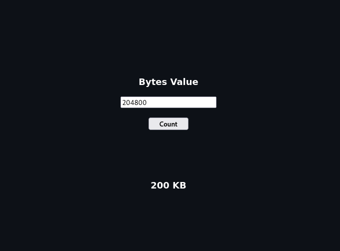

# BytesCounter
## calculator for converting Bytes to KB/MB/GB/TB 

### BCounter.py

- Usage
```bash
	python3 BCounter.py <bytes value>

	ex:
		python3 BCounter.py 2048
		[+] 2.00 KB
``` 
### BCounter.c 

- Compile from source
```bash
	gcc BCounter.c -o BCounter
```

- Usage
```bash
 	./BCounter 
 	Enter Byte value : 506606
	[+] 494.73 KB
```
### BCounter.php   


